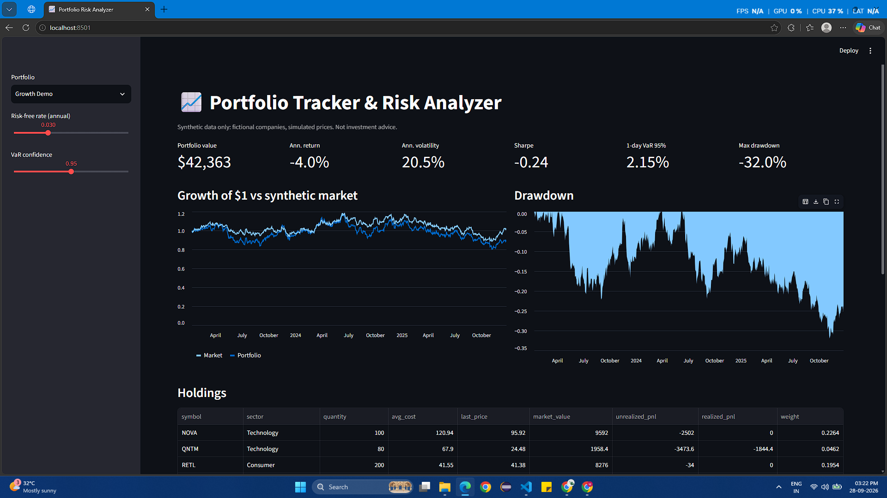
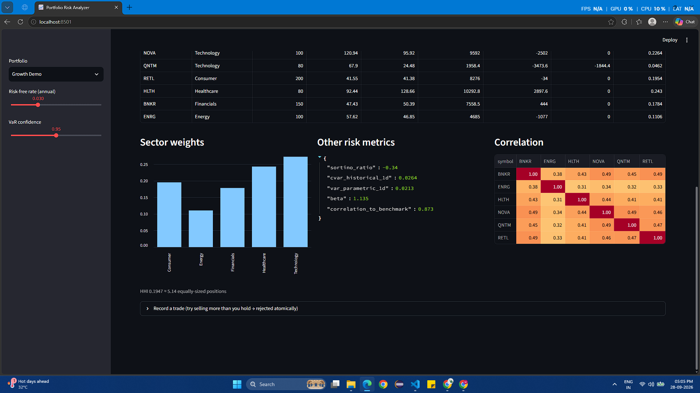
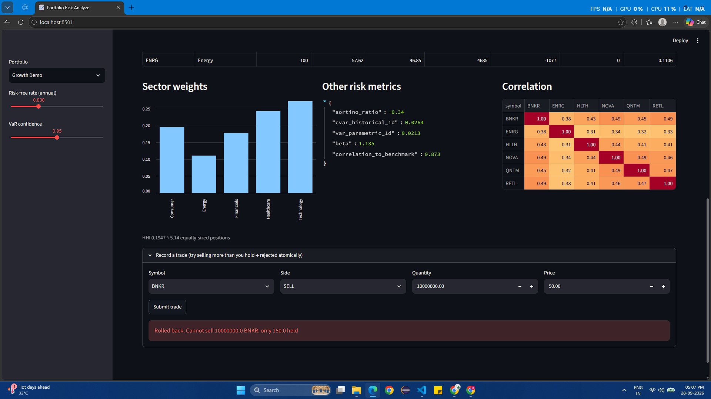

# 📈 Stock Portfolio Tracker & Risk Analyzer

Python + SQL project that records trades in a relational database, values a portfolio over time, and
computes the risk metrics an analyst would look at: **Sharpe, Sortino, VaR, CVaR, beta, drawdown and concentration**,
all shown in an interactive dashboard.

> **Dummy data only.** Companies are fictional (`NOVA`, `HLTH`, …) and prices are simulated with a fixed random seed.
> No real bank details, brokerage accounts or market data are used anywhere. Not investment advice.

## 🔗 Live demo

**👉 https://YOUR-APP-NAME.streamlit.app** *(add after deploying, see [Deploy](#deploy-the-live-demo))*

## Screenshots

| Dashboard overview | Risk metrics & correlation | Trade rejected (ACID rollback) |
|---|---|---|
|  |  |  |

*(Save your own screenshots into `docs/screenshots/` with these filenames after running the app.)*

## Features

- **SQL schema** with primary/foreign keys, `CHECK` constraints, indexes, and views that use aggregation and a `LAG()` window function
- **Atomic trade recording**: overselling is rejected and rolled back
- **Holdings**: weighted-average cost, market value, realised and unrealised P&L
- **Risk analytics**: annualised return/volatility, Sharpe, Sortino, max drawdown, historical and parametric VaR, CVaR, beta vs a benchmark, correlation matrix, HHI concentration, sector weights
- **Streamlit dashboard** with adjustable risk-free rate and VaR confidence level
- Unit tests that check the maths against hand calculations

## Architecture

```
seed.py ──► SQLite (schema.sql) ◄── app/db.py (ACID trade writes)
                 │
           app/analytics.py  (pandas/numpy: P&L + risk maths)
                 │
           dashboard.py  (Streamlit UI)
```

## Quick start

```bash
python -m venv .venv && source .venv/bin/activate     # Windows: .venv\Scripts\activate
pip install -r requirements.txt

python seed.py --reset                 # creates portfolio.db with synthetic data
streamlit run dashboard.py             # dashboard -> http://localhost:8501
python -m unittest discover -s tests   # or: pytest
```

## Finance concepts used

Each concept below maps to a specific place in the code.

| Concept | What it means | Where it's used |
|---|---|---|
| **Weighted-average cost basis** | Cost per share = total cost ÷ shares held; a sale realises `qty × (sell price − avg cost)` | `compute_holdings()` in `analytics.py` |
| **Realised vs unrealised P&L** | Realised = locked in by selling; unrealised = paper gain on shares still held | Holdings table |
| **Time-weighted return** | Daily return = P&L on yesterday's positions ÷ yesterday's value, so deposits/trades don't distort performance | `portfolio_returns()` |
| **Annualisation (√252)** | Daily volatility × √252 trading days ≈ annual volatility | `risk_metrics()` |
| **Volatility** | Standard deviation of returns, a measure of how much the value swings | `annualized_volatility` |
| **Sharpe ratio** | `(mean excess return) ÷ (std dev of returns) × √252`; return earned per unit of total risk above the risk-free rate | `sharpe_ratio` |
| **Sortino ratio** | Like Sharpe but penalises only *downside* deviation, since upside volatility isn't a "risk" to most investors | `sortino_ratio` |
| **Maximum drawdown** | Worst peak-to-trough fall of the cumulative return curve | `max_drawdown()` |
| **Value at Risk (VaR)** | "On 95% of days the loss should not exceed X%". Computed two ways: historical (5th percentile of returns) and parametric (normal distribution, `z·σ − μ`) | `var_historical_1d`, `var_parametric_1d` |
| **CVaR / Expected Shortfall** | Average loss on the days *worse* than VaR; captures tail risk that VaR ignores. Always ≥ VaR | `cvar_historical_1d` |
| **Beta** | `Cov(portfolio, market) ÷ Var(market)`; sensitivity to the market (β>1 amplifies market moves) | `beta` vs the `MKT` index |
| **Correlation & diversification** | Assets that don't move together reduce portfolio risk | `correlation_matrix()` |
| **Concentration (HHI)** | Sum of squared weights; `1/HHI` = "effective number" of equal positions. Flags over-concentration | `concentration()` |
| **Risk-free rate** | Return of a "safe" asset; the baseline subtracted in Sharpe/Sortino | Dashboard slider |
| **Geometric Brownian Motion + one-factor model** | Standard model for simulating stock prices; each stock = β × market shock + its own shock | `seed.py` (generates the dummy prices) |
| **ACID transactions** | **A**tomicity: a trade fully succeeds or leaves no trace. **C**onsistency: `CHECK`/`FOREIGN KEY` rules always hold. **I**solation: `BEGIN IMMEDIATE` stops two writers overselling the same shares. **D**urability: committed trades survive a crash | `record_trade()` in `db.py`; test `test_oversell_rejected_and_rolled_back` |
| **Referential integrity** | A trade can't reference a non-existent portfolio or asset | Foreign keys in `schema.sql` |

### A note on the demo results
The demo portfolios are simulated, so their returns mean nothing about real markets. What *is* meaningful is the
relationship between the metrics: the "Growth" portfolio has higher volatility, beta (~1.1) and VaR than the "Conservative"
one (beta ~0.7), exactly as the finance theory predicts.

## Deploy the live demo

1. Push this repo to GitHub (`portfolio.db` is git-ignored; the app seeds itself on first run).
2. Go to [share.streamlit.io](https://share.streamlit.io) → **New app** → pick the repo → main file `dashboard.py`.
3. Paste the resulting URL into the **Live demo** section at the top of this README.

*(Hosted filesystems are ephemeral: trades added on the public demo reset when the app restarts, which is fine for a demo.)*

## Limitations / possible extensions

- Backdated SELLs are validated against total holdings, not holdings on that specific date
- No dividends, fees, splits or currency conversion
- Ideas: efficient-frontier optimisation, Monte-Carlo VaR, PostgreSQL + Alembic migrations

## Project structure

```
├── app/           db.py · analytics.py
├── dashboard.py   Streamlit UI
├── schema.sql     tables, constraints, views
├── seed.py        synthetic data generator
├── tests/         unit + end-to-end tests
└── docs/screenshots/
```
